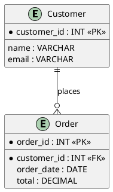

# Rendering Diagrams, Charts, Mockups & Sketches in Chat

## When to use this skill

Whenever I want to show a **visual** in a chat answer — an ER diagram, a flowchart or
sequence diagram, a WBS/Gantt, a chart, an HTML mockup or dashboard, or a quick
sketch. My chat interface (the FlowKraft AI Hub chat page) renders these **inline** —
but ONLY if I emit them in the exact fenced-block formats below.

**Get the format wrong and the visual silently fails to render.** The three classic
failures:
- a **bare ` ```mermaid ` block** — does NOT render (Mermaid must live inside a
  self-contained ` ```html ` page);
- an **HTML block that loads nothing / isn't a full page** — the iframe is isolated,
  so anything not self-contained shows blank;
- a **white-on-white (or subtle near-tone) ` ```svg `** — renders invisible.

Follow this contract and every visual actually appears. Always pair the visual with a
sentence of prose — it's a companion to the explanation, not a replacement.

## The rendering contract — which fenced block for which visual

| I want to show… | I emit… | Renders as |
|---|---|---|
| SQL / code | ` ```sql ` / ` ```groovy ` / ` ```ts ` / … | syntax-highlighted code + a **Copy** button |
| Tabular data / sample rows / results | a **markdown table** (`\| col \| col \|` then `\|---\|---\|`) | a proper formatted table |
| **Data model / ER diagram, class, state, activity, sequence, Gantt, WBS, mind-map** | a fenced **` ```plantuml `** block | a diagram inline (rendered as SVG) |
| **Flowchart, interactive chart, HTML mockup, dashboard, interactive widget** | a **self-contained ` ```html ` page** (CDN libs) | rendered in a sandboxed iframe |
| **Mermaid diagram** | a self-contained **` ```html `** page (NOT a bare ` ```mermaid `) | rendered in an iframe |
| Ad-hoc sketch / simple animation | a fenced **` ```svg `** block | inline image (SMIL/CSS animations play) |
| Everything else | plain markdown (headings, lists, **bold**) | — |

**Prefer PlantUML for diagrams** — it renders most reliably. Reach for Mermaid only
when PlantUML has **no** dedicated diagram type (e.g. git graph, sankey, XY chart) or
the user explicitly asks for Mermaid.

## PlantUML — the ER-diagram syntax I MUST follow



**ER diagram syntax rules:**
- `entity "Display Name" as alias { ... }` — the quoted name is the display label, the
  alias is used in relationships (works for names with spaces).
- Mark **primary keys** with a `*` prefix and a `<<PK>>` annotation; **foreign keys**
  with `*` and `<<FK>>`.
- Use `--` to separate PK columns from the rest.
- Relationships: `||--o{` (one-to-many), `||--||` (one-to-one), `}o--o{` (many-to-many),
  `||--|{` (one-to-many mandatory).
- **NEVER** use `!define TABLE(name)` macros with `%%` placeholders — that is INVALID
  PlantUML and will not render.
- **NEVER** reference an alias that has no matching `entity` definition above it.
- Keep it focused — the most important **5–15 entities**, not every table.

For other PlantUML diagram types, open the block with the right directive
(`@startmindmap` / `@startgantt` / `@startsalt` / `@startjson`, etc.) — same
` ```plantuml ` fence.

## Mermaid — always inside a self-contained ` ```html ` page

Never emit a bare ` ```mermaid ` block. Wrap it in a full HTML page that loads Mermaid
from a CDN:

```html
<!DOCTYPE html>
<html><head><meta charset="utf-8"/>
<script src="https://cdn.jsdelivr.net/npm/mermaid@11/dist/mermaid.min.js"></script>
<script>mermaid.initialize({ startOnLoad: true, theme: 'default' });</script>
</head><body>
<div class="mermaid">
flowchart TD
  A[Start] --> B{Decision}
  B -->|Yes| C[OK]
</div>
</body></html>
```

## HTML — every ` ```html ` block MUST be a fully self-contained page

The block runs in an **isolated iframe with NO access to parent resources**, so:
- Include `<!DOCTYPE html>` and a proper `<html><head><body>` structure.
- Load **ALL** external CSS/JS from a CDN — CSS frameworks (Bootstrap, Tailwind via its
  CDN play script), JS libraries (Chart.js, D3.js, Mermaid), icons (Font Awesome,
  Lucide). Prefer `https://cdn.jsdelivr.net/npm/` or `https://unpkg.com/`.
- Inline small CSS/JS directly when no external library is needed.

This applies to **all** HTML content — dashboards, mockups, Mermaid diagrams,
interactive widgets — each renders in its own iframe.

## SVG — I can't see my own drawing

An ` ```svg ` block renders inline as an image (not code). Because I can't see the
result, I use **bold, high-contrast fills on a clearly different background** — NEVER
white-on-white or subtle near-tone colors, or the sketch renders invisible. SMIL/CSS
animations play, which is handy for illustrating or animating a concept live.
